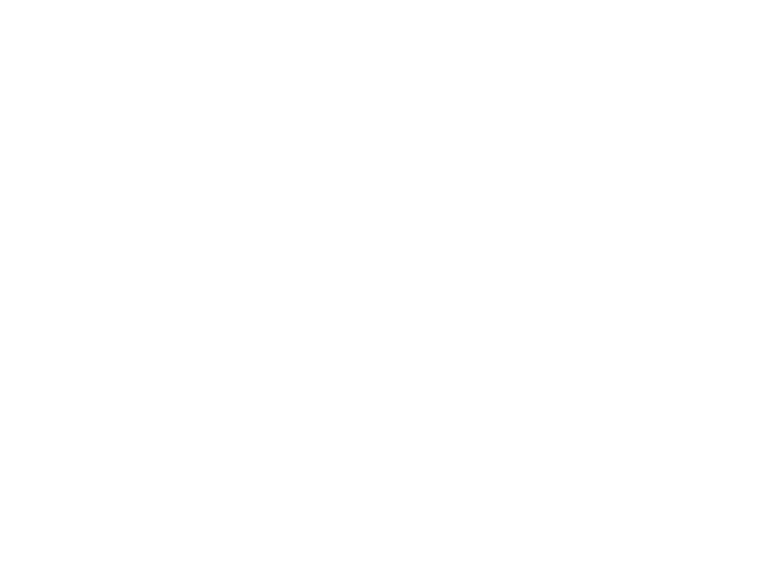

  <h1 style="color: #ff7777;" >Jetsadakorn Muangwichit</h1>
  
  

  
  

---

### 👨‍💻 Professional Profile

ปัจจุบันผมเป็นนักศึกษาชั้นปีที่ 3 สาขาวิทยาการคอมพิวเตอร์ มหาวิทยาลัยเทคโนโลยีราชมงคลสุวรรณภูมิ ศูนย์พระนครศรีอยุธยา หันตรา โดยมีความถนัดโดดเด่นในรูปแบบ **Hybrid Skill** ที่ผสมผสานทักษะการเขียนโปรแกรม (Web Development) เข้ากับการออกแบบ (UI/UX Design) ได้อย่างลงตัว

* 🚀 **ความเชี่ยวชาญ:** พัฒนา Web Application แบบ Full-stack และออกแบบ Digital Experience
* 💡 **เป้าหมาย:** สร้างสรรค์ซอฟต์แวร์ที่ใช้งานง่ายและมีประสิทธิภาพสูงสุด (User-Centric Design)
* 🎓 **การศึกษา:** วิทยาการคอมพิวเตอร์ (CS), RMUTSB Ayutthaya

---

---

### 👨‍💻 About Me

I'm a 3rd-year **Computer Science** student at **RMUTSB (Ayutthaya)**. I bridge the gap between robust **Web Development** and intuitive **UI/UX Design**.

* 🚀 **Current Focus:** Full-stack Architecture & AI Integration
* 💡 **Philosophy:** Building software that doesn't just work, but feels great to use.
* 🎓 **Education:** Junior CS Student @ Rajamangala University of Technology Suvarnabhumi.

---

### 🛠️ Tech Stack & Tools

<table align="center">
  <tr>
    <td align="center" width="33%">
      <strong>Frontend</strong>  
      
    </td>
    <td align="center" width="33%">
      <strong>Backend & DB</strong>  
      
    </td>
    <td align="center" width="33%">
      <strong>Tools & Design</strong>  
      
    </td>
  </tr>
</table>

---

### 📊 GitHub Contributions & Stats

  

  

---

### 📬 Connect with Me

| **Email** | **Portfolio** | **GitHub** |
| :---: | :---: | :---: |
|  |  |  |

 

  
   
  <i>Visitor Count</i>

