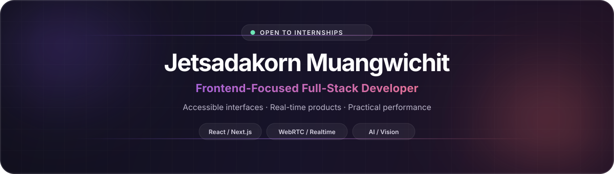

  

Final-year Computer Science student building accessible, high-performance, and practical web products.

  

[**About**](#about-me) &nbsp;·&nbsp; [**Selected Work**](#selected-work) &nbsp;·&nbsp; [**Stack**](#technology-stack) &nbsp;·&nbsp; [**Activity**](#github-activity) &nbsp;·&nbsp; [**Contact**](#contact)

 

## About Me

<table>
<tr>
<td width="64%" valign="top">

### Product-minded frontend engineering

I am a final-year Computer Science student at **Rajamangala University of Technology Suvarnabhumi, Ayutthaya**. I enjoy transforming product ideas into polished web experiences, from interface details and accessibility to real-time communication, performance, AI-assisted features, and secure full-stack implementation.

I care about software that is not only visually polished, but also **useful, maintainable, responsive, and reliable in real-world use**.

</td>
<td width="36%" valign="top">

### Currently

- Building with **React, Next.js, TypeScript, Vite, and Supabase**
- Exploring **WebRTC, AI vision, and browser-side ML**
- Practicing **Git, pull requests, testing, and deployment workflows**
- Looking for a **Frontend, Full-Stack, or Software Engineering internship**

</td>
</tr>
</table>

 

 

## What I Build

<table>
<tr>
<td width="33.33%" valign="top" align="center">

### Accessible UI

Interfaces designed around clarity, keyboard support, responsive behavior, and practical usability.

</td>
<td width="33.33%" valign="top" align="center">

### Real-Time Products

Browser-to-browser communication, live updates, presence, pairing, and collaborative interactions.

</td>
<td width="33.33%" valign="top" align="center">

### AI-Assisted Tools

Useful AI and computer-vision features integrated into focused product experiences.

</td>
</tr>
</table>

 

## Selected Work

<table>
<tr>
<td width="50%" valign="top">

### [Zendix](https://github.com/7sadakonr/Zendix-Filetransfer-Web-App)

A browser-based P2P application for transferring clipboard text, files, and folders directly through WebRTC data channels, with QR pairing and PWA support.

**Why it stands out**

- Direct browser-to-browser transfer
- QR-based device pairing
- Clipboard, file, and folder sharing
- Installable PWA experience

`React 18` `Vite 5` `PeerJS` `WebRTC`  
`Zustand` `Tailwind CSS 3` `Framer Motion` `PWA`

 

</td>
<td width="50%" valign="top">

### [Nyeta](https://github.com/7sadakonr/Nyeta)

An accessible visual-assistance platform combining native WebRTC calls, Gemini-powered scene, currency, and document vision, plus browser-side object guidance.

**Why it stands out**

- Accessibility-first product direction
- Real-time remote assistance
- AI scene, currency, and document vision
- Browser-side object detection

`Next.js 16` `React 19` `Gemini 3.1 Flash Lite`  
`Native WebRTC` `Pusher` `TensorFlow.js` `COCO-SSD`

 

</td>
</tr>
</table>

 

### More Projects

<table>
<tr>
<td width="50%" valign="top">

### [Personal Portfolio](https://github.com/7sadakonr/7sadakonr-portfolio)

An interactive universe-themed portfolio featuring custom CSS effects, command-menu navigation, Lenis smooth scrolling, and an EmailJS contact flow.

`React 19` `TypeScript` `Vite 7` `React Router 7`  
`Lenis` `EmailJS` `React Rough Notation` `Custom CSS`

</td>
<td width="50%" valign="top">

### [Integrated Task Management](https://github.com/7sadakonr/Todo-List)

A task-management application with Supabase authentication, PostgreSQL Row-Level Security, CRUD and Kanban workflows, breached-password checking, and WebGL effects.

`Next.js 16` `React 19` `TypeScript 5` `Tailwind CSS 4`  
`Supabase Auth` `PostgreSQL` `RLS` `Three.js` `OGL`

</td>
</tr>
</table>

 

## Technology Stack

### Frontend & Languages

  

### Backend, Data & Infrastructure

  

### AI, Real-Time & Product Tools

  

 

## Engineering Approach

<table>
<tr>
<td width="25%" valign="top" align="center">

### 01

**Understand**

Clarify the user problem, constraints, and expected outcome before choosing a solution.

</td>
<td width="25%" valign="top" align="center">

### 02

**Design**

Build a clear interface hierarchy with responsive and accessible interaction patterns.

</td>
<td width="25%" valign="top" align="center">

### 03

**Implement**

Use maintainable components, practical architecture, and secure data handling.

</td>
<td width="25%" valign="top" align="center">

### 04

**Validate**

Review performance, edge cases, accessibility, and AI-assisted changes before shipping.

</td>
</tr>
</table>

 

## GitHub Activity

<picture>
  <source media="(prefers-color-scheme: dark)" srcset="https://github-readme-stats.vercel.app/api?username=7sadakonr&show_icons=true&hide_border=true&bg_color=00000000&title_color=C084FC&text_color=E5E7EB&icon_color=FF7777&rank_icon=github" />
  <source media="(prefers-color-scheme: light)" srcset="https://github-readme-stats.vercel.app/api?username=7sadakonr&show_icons=true&hide_border=true&bg_color=00000000&title_color=7C3AED&text_color=334155&icon_color=E85D75&rank_icon=github" />
  
</picture>
<picture>
  <source media="(prefers-color-scheme: dark)" srcset="https://github-readme-stats.vercel.app/api/top-langs/?username=7sadakonr&layout=compact&langs_count=8&hide_border=true&bg_color=00000000&title_color=C084FC&text_color=E5E7EB" />
  <source media="(prefers-color-scheme: light)" srcset="https://github-readme-stats.vercel.app/api/top-langs/?username=7sadakonr&layout=compact&langs_count=8&hide_border=true&bg_color=00000000&title_color=7C3AED&text_color=334155" />
  
</picture>

  

<picture>
  <source media="(prefers-color-scheme: dark)" srcset="https://raw.githubusercontent.com/7sadakonr/7sadakonr/output/github-contribution-grid-snake-dark.svg" />
  <source media="(prefers-color-scheme: light)" srcset="https://raw.githubusercontent.com/7sadakonr/7sadakonr/output/github-contribution-grid-snake.svg" />
  
</picture>

  

 

## Contact

### Let’s build something useful.

I am currently open to **Frontend, Full-Stack, and Software Engineering internship opportunities**.

 

 

Ayutthaya, Thailand · Available for internship opportunities

 

  

